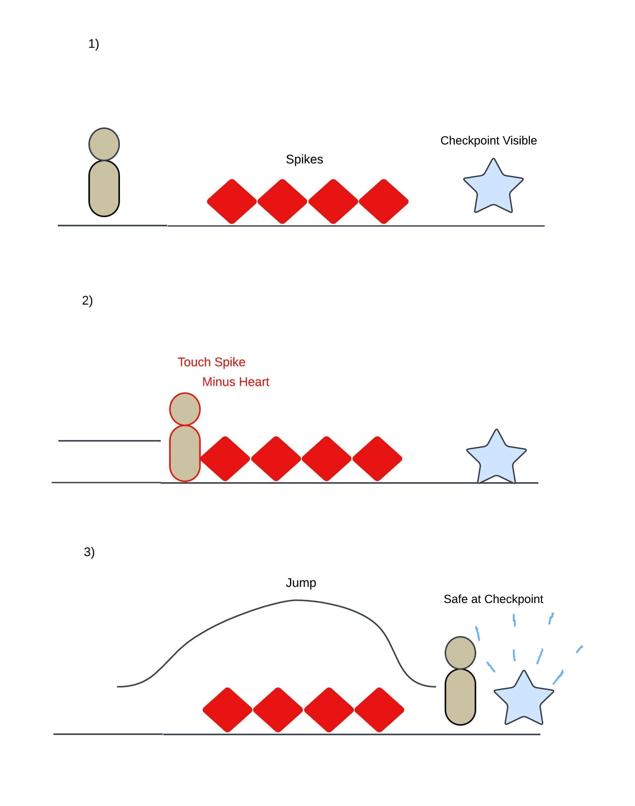
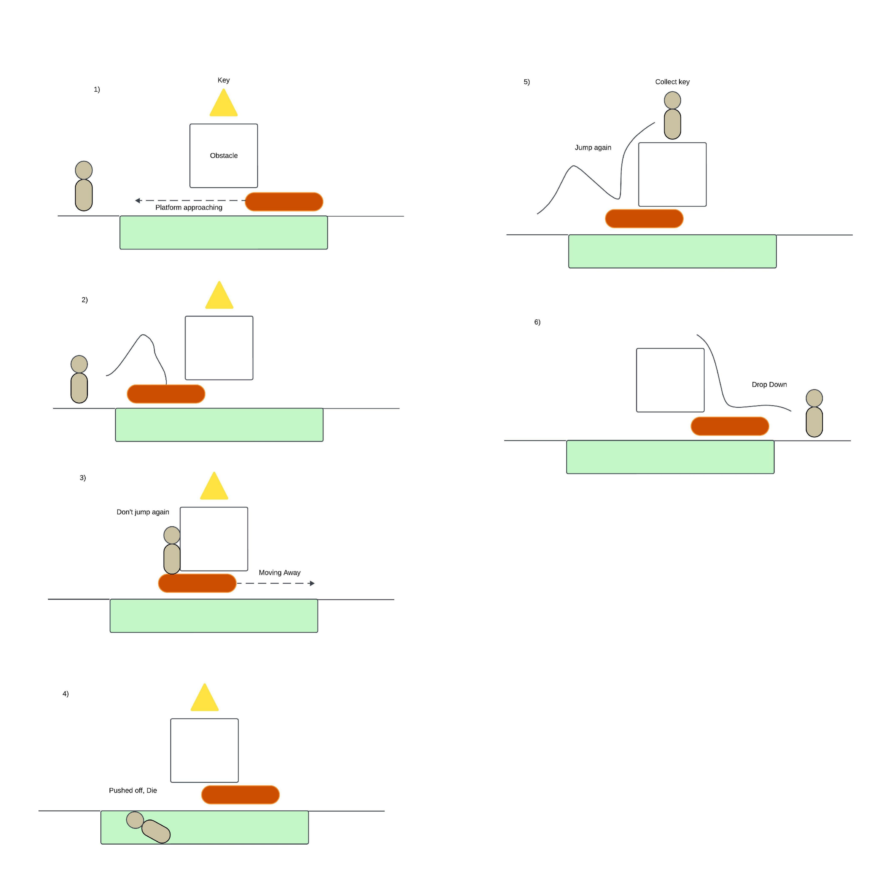

# COMP2150  - Level Design Document
### Name: Annais Williamson
### Student number: 46502548

This document discusses and reflects on the design of your platformer level for the Level Design assessment. It should be 1500 words. Make sure you delete this and all other instructional text throughout the document before checking your word count prior to submission. Hint: You can check word count by copying this text into a Word or Google doc.

## 1. Player Experience (~700 words)
Outline and justify how your level design facilitates the core player experience goals outlined in the assignment spec. Each section should be supported by specific examples and screenshots of your game encounters that highlight design choices made to facilitate that particular experience.

### 1.1. Discovery
What does the player learn? How does your encounter and broader level design facilitate learning in a way that follows good design practice?

### 1.2. Drama
What is the intensity curve? How does your design facilitate increasing yet modulating intensity, with moments of tension and relief? 

### 1.3. Challenge
What are the main challenges? How have you designed and balanced these challenges to control the difficulty curve and keep the player in the flow channel?

### 1.4. Exploration
How does your level design facilitate autonomy and invite the player to explore? How do your aesthetic and layout choices create distinct and memorable spaces and/or places?

## 2. Core Gameplay (469 words)

### 2.1. Acid
Acid is used as a good blanket obstacle that has the player traverse through the level by another means, typically moving platforms.

### 2.2. Moving Platforms
THe moving platforms provide access to new areas and create a puzzle for players to use as they traverse through the level. There are initially two platforms the player can use, one takes them towards an item and the other the key.

### 2.3. Keys
After an initial jumping over acid lakes phase, there is a small challenge to collect the first key that involves jumping with the moving platform to successfully pass the long area of acid. The Platform will pass under the obstacle but the player will be pushed off and die in the acid.

 

### 2.4. Spikes
The spikes are introduced to show environmental damage the player can gain. The spikes will take one heart of damage and push the player back. It is easy to overcome the spikes by jumping over them or by avoiding them if they are on the ceiling or walls of  the level.

### 2.5. Checkpoints
Checkpoints are made available once successfully traversing a section or when a tricky obstacle has been passed or defeated. They allow the player to feel safe with their progress as well as not having them restart from the beginning of the level.

### 2.6. Passthrough Platforms
Once the spikes have been safely avoided and the gun collected from the skeleton, there is a pass through platform that drops the player directly on the edge of the acid pool. From there the player can use the moving platform to jump up and get the key if they went up instead of across.

### 2.7. Weapon Pickup (Gun)
The gun is made available to kill enemies that the player faces in the second section of the level but it is not necessary to get.

### 2.8. Weapon Pickup (Staff) 
The staff can be used in close combat at the risk of still getting injured by the enemy.

### 2.9. Chompers
Chompers are the first enemy at the beginning of section 2. If the player did not pick up the gun from section one then they will have to dodge and avoid the chompers or they can kill by making a ranged attack. If the player gets the staff after defeating spitters then they can kill the enemies with closer ranged attacks.

### 2.10. Spitters
Spitters have projectiles that make it hard to dodge from some angles. The player can choose to jump on the spitters platforms or use a moving platform above them to reach a health pack.

### 2.11. Health Pickups
The health available allows the players to receive one heart. They can not go over 5 hearts and the health pack is gone once it has been used. The health p[ick ups are put throughout the level after tricky obstacles where the player will typically lose health or in special rooms that have a few for the player to refresh their health before continuing on.

## 3. Spatiotemporal Design
A section on Spatiotemporal Design, which includes your molecule diagram and annotated level maps (one for each main section of your level). These diagrams may be made digitally or by hand, but must not be created from screenshots of your game. The annotated level maps should show the structure you intend to build, included game elements, and the path the player is expected to take through the level. Examples of these diagrams are included in the level design lectures.

No additional words are necessary for this section (any words should only be within your images/diagrams).
 
### 3.1. Molecule Diagram

### 3.2. Level Map – Section 1

### 3.3.	Level Map – Section 2

### 3.4.	Level Map – Section 3

## 4. Iterative Design (~400 words)
## 4. Iterative Design (356 words)

Iterative design helped with each section to determine distance between objects and overall flow. Some sections I would change the position of items to make it more rewarding to try a different path rather than have it be there for added traversal. 

In section 2 I added an additional platform on the way down to add a bit more interaction rather than just waiting for the next sequence to begin. In Section 3, two floors were switched around as I believed the new encounter broke up the order of events rather than just having a repeat of areas one after the other.

Originally I thought the controlled player could crouch and move forward but they only remain in one spot. I still added a crouching section but put it on two moving platforms with enemies below that could be accessed and with spikes overheard in the second crouched portion to deter the player from standing.

After playing through the level a few times, I added “storage rooms” to areas that took a lot of attempts causing the player to lose health leading to subsequent game overs. The overall adjustment of checkpoints was also affected when traversing through harder areas in each section.

After playing-testing a few times it was helpful to see where I could increase the rate of enemies or have more obstacles to heighten the difficulty through the overall level. It was also helpful to know where to cut off access to areas I did not want the player to venture to as it may cut content or have them go out of bounds. The iterative design process allowed for overall adjustments to difficulty and aesthetic while also creating better flow between sections that made it feel like a new area with new challenges.

Further use of iterative design may prove to show where typical failings I had not noticed myself are, if areas are too difficult, or if they are in need of adjustment so they do not feel plain or boring to the player. Perhaps further experimentation with the assets would grow further creative obstacles that add to a player’s creative solutions.

## Generative AI Use Acknowledgement

Use the below table to indicate any Generative AI or writing assistance tools used in creating your document. Please be honest and thorough in your reporting, as this will allow us to give you the marks you have earnt. Place any drafts or other evidence inside this repository. This form and related evidence do not count to your word count.
An example has been included. Please replace this with any actual tools, and add more as necessary.

### Tool Used: ChatGPT
**Nature of Use** Finding relevant design theory.

**Evidence Attached?** Screenshot of ChatGPT conversation included in the folder "GenAI" in this repo.

**Additional Notes:** I used ChatGPT to try and find some more relevant design theory that I could apply to my game. After googling them, however, I found most of them were inaccurate, and some didn't exist. One theory mentioned, however, was useful, and I've incorporated it into my work.

### Tool Used: Example
**Nature of Use** Example Text

**Evidence Attached?** Example Text

**Additional Notes:** Example Text

