
# COMP2150  - Level Design Document
### Name: Annais Williamson
### Student number: 46502548

## 1. Player Experience (680 words)

### 1.1. Discovery
The player learns core skills and mechanics that will help progres through the levels. They will learn what certain terrain, items and surfaces do and how it will affect how they play the game.
Learning throughout the levels is incremental. The player will see a toxic green liquid that will kill them but is easy to overcome by jumping over the small opening. Next there will be a longer vat of acid the player needs to traverse and the means are not as simple as before. There way be incremental stepping stones the player needs to use, timing their jumps correctly, or a moving platform that will need to be used. Broaden level design should not overwhelm or complicate player action unless intended as a difficult game. This increases a players involvement and thinking but offers the fun to not be so unobtainable. The level design strives not to overwhelm the player all at once but to increase the difficulty on each subsequent selection. The moving platforms first show to simply jump, and then progress to jumps with spikes for a final obstacle of spikes on the ceiling. This is not only to help the player learn but to not prove so difficult on the first run through.

### 1.2. Drama
The intensity curve that increases and decreases the drama for the level design is one that starts low and gradually flows upwards. With each new skill or environment the difficulty will increase but after accomplishing the new feat the difficulty will sag as the player comes to mastering these new skills. As the level progresses it will become more difficult and the combined use of skills and movement will have to be perfected rather than being lucky or easy to overcome. Some parts are just simply jumping over obstacles while others need precise timing or weapons to beat foes before they damage you This essentially creates a playground for players to practice the skills and test reflexes that increases and modulates intensity. Of course, when overcoming the trickier sections of the level, players will be faced with a feeling of triumph and relief, culminating in the final procession of reaching the locked door with the three keys and winning. This relief can also be felt when health packs become available or checkpoints are reached.

### 1.3. Challenge
The main challenges faced by the player are the ability to move. Different forms of damage are throughout the level design and add to the difficulty experienced in each section. Sometimes the first way to overcome an object may not apply in subsequent trials so it is important for the player to adapt and think of how the environment has changed and how they can make use of it. Being able to move over poisonous acid, time correct movements to avoid shooters and upgrade your character skills with equipment all aid and abet the challenges faced in the levels. There are sections that provide easier though still interactive options rather than just going headstrong into a fight. Some might find crouching and jumping tedious while people who enjoy platforms will excel in timing and flexibility. The challenge curve is gradually increasing as the players experience and skills is also increasing so the level completion is obtainable whilst still having some challenge and keeping a flow.

### 1.4. Exploration
Whilst the level design is pretty linear, there are usually two options of where and what objects and items can be obtained first. The first section of the game can still be traversed entirely from the second section but the third is a point of no return. I tried to offer different environmental challenges and aesthetics. Such as being underground compared to the beginning being in the open sky. Some areas might be shocking with the step up in difficulty but overall fits with a theme of exploration and survival. I most enjoy the wall jumps as they are a classic element to platformers but offer a sense of danger with how close the spikes appear. The “hidden” storage rooms are also worth the exploration but are more forced by a need to survive rather than explore.

## 2. Core Gameplay (469 words)

### 2.1. Acid
Acid is used as a good blanket obstacle that has the player traverse through the level by another means, typically moving platforms.

### 2.2. Moving Platforms
THe moving platforms provide access to new areas and create a puzzle for players to use as they traverse through the level. There are initially two platforms the player can use, one takes them towards an item and the other the key.

### 2.3. Keys
After an initial jumping over acid lakes phase, there is a small challenge to collect the first key that involves jumping with the moving platform to successfully pass the long area of acid. The Platform will pass under the obstacle but the player will be pushed off and die in the acid.

### 2.4. Spikes
The spikes are introduced to show environmental damage the player can gain. The spikes will take one heart of damage and push the player back. It is easy to overcome the spikes by jumping over them or by avoiding them if they are on the ceiling or walls of  the level.

### 2.5. Checkpoints
Checkpoints are made available once successfully traversing a section or when a tricky obstacle has been passed or defeated. They allow the player to feel safe with their progress as well as not having them restart from the beginning of the level.

### 2.6. Passthrough Platforms
Once the spikes have been safely avoided and the gun collected from the skeleton, there is a pass through platform that drops the player directly on the edge of the acid pool. From there the player can use the moving platform to jump up and get the key if they went up instead of across.

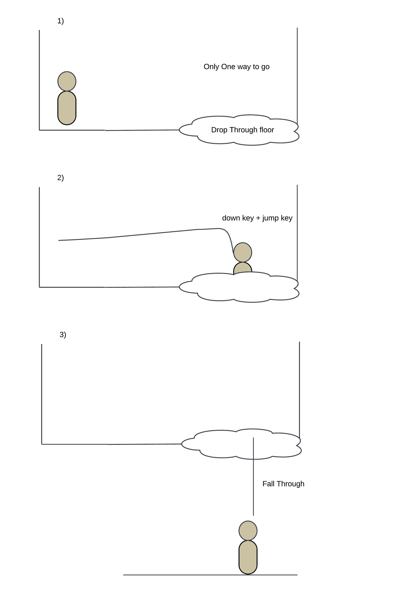

### 2.7. Weapon Pickup (Gun)
The gun is made available to kill enemies that the player faces in the second section of the level but it is not necessary to get.

### 2.8. Weapon Pickup (Staff) 
The staff can be used in close combat at the risk of still getting injured by the enemy.

### 2.9. Chompers
Chompers are the first enemy at the beginning of section 2. If the player did not pick up the gun from section one then they will have to dodge and avoid the chompers or they can kill by making a ranged attack. If the player gets the staff after defeating spitters then they can kill the enemies with closer ranged attacks.

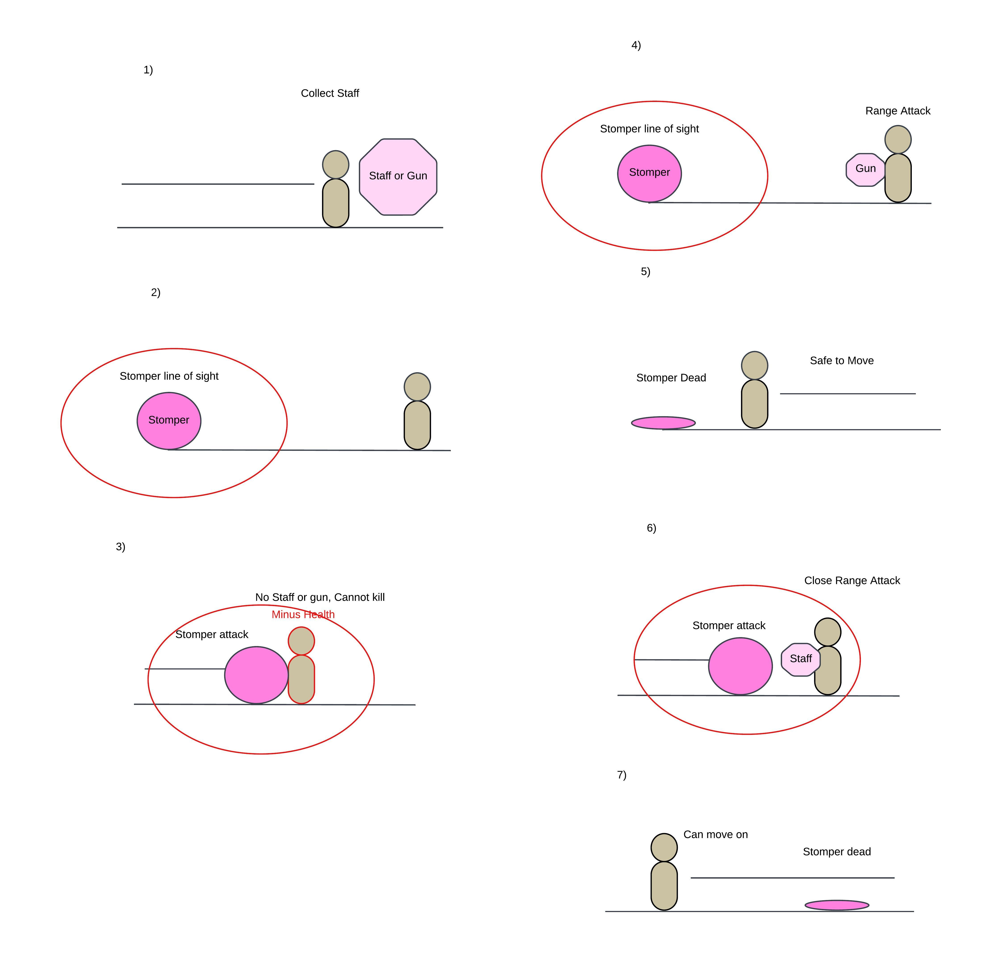

### 2.10. Spitters
Spitters have projectiles that make it hard to dodge from some angles. The player can choose to jump on the spitters platforms or use a moving platform above them to reach a health pack.

### 2.11. Health Pickups
The health available allows the players to receive one heart. They can not go over 5 hearts and the health pack is gone once it has been used. The health p[ick ups are put throughout the level after tricky obstacles where the player will typically lose health or in special rooms that have a few for the player to refresh their health before continuing on.

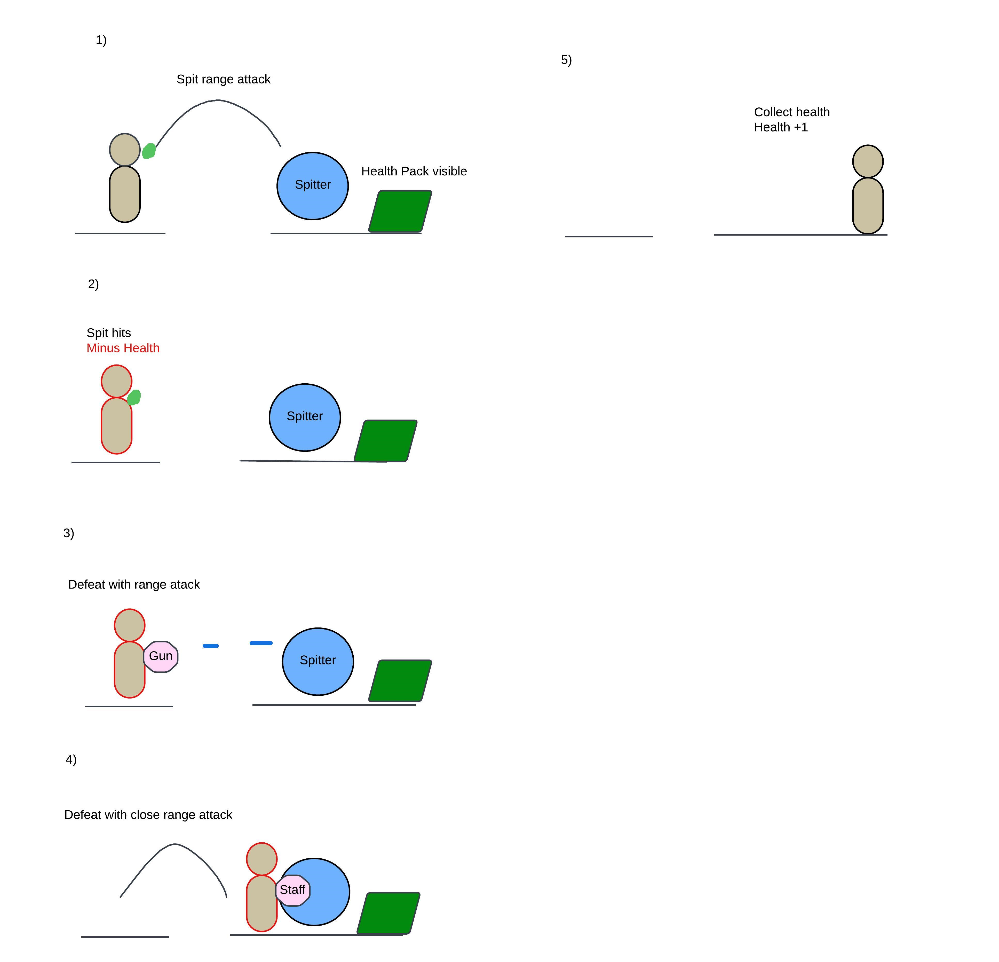

## 3. Spatiotemporal Design
A section on Spatiotemporal Design, which includes your molecule diagram and annotated level maps (one for each main section of your level). These diagrams may be made digitally or by hand, but must not be created from screenshots of your game. The annotated level maps should show the structure you intend to build, included game elements, and the path the player is expected to take through the level. Examples of these diagrams are included in the level design lectures.

No additional words are necessary for this section (any words should only be within your images/diagrams).
 
### 3.1. Molecule Diagram

### 3.2. Level Map – Section 1
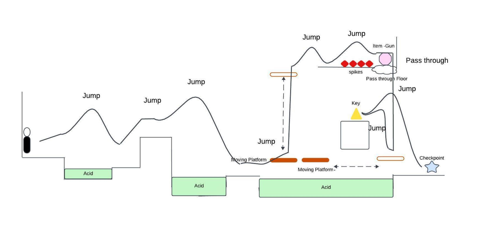

### 3.3.	Level Map – Section 2
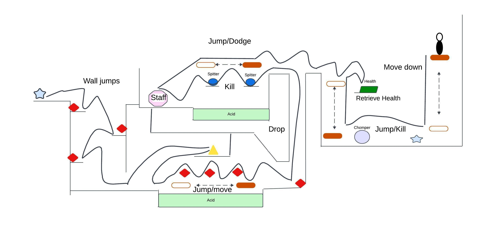

### 3.4.	Level Map – Section 3
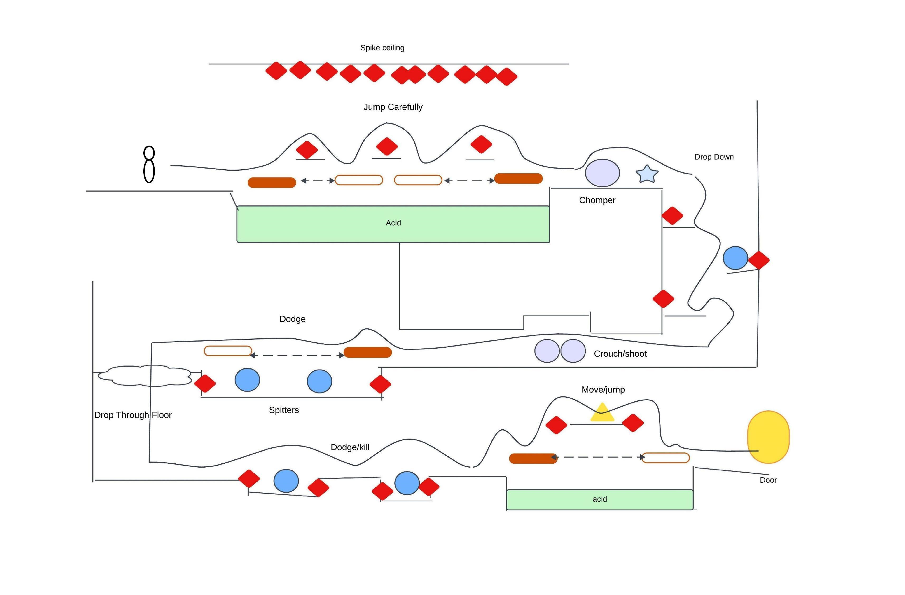

## 4. Iterative Design (356 words)

Iterative design helped with each section to determine distance between objects and overall flow. Some sections I would change the position of items to make it more rewarding to try a different path rather than have it be there for added traversal. 

In section 2 I added an additional platform on the way down to add a bit more interaction rather than just waiting for the next sequence to begin. In Section 3, two floors were switched around as I believed the new encounter broke up the order of events rather than just having a repeat of areas one after the other.

Originally I thought the controlled player could crouch and move forward but they only remain in one spot. I still added a crouching section but put it on two moving platforms with enemies below that could be accessed and with spikes overheard in the second crouched portion to deter the player from standing.

After playing through the level a few times, I added “storage rooms” to areas that took a lot of attempts causing the player to lose health leading to subsequent game overs. The overall adjustment of checkpoints was also affected when traversing through harder areas in each section.

After playing-testing a few times it was helpful to see where I could increase the rate of enemies or have more obstacles to heighten the difficulty through the overall level. It was also helpful to know where to cut off access to areas I did not want the player to venture to as it may cut content or have them go out of bounds. The iterative design process allowed for overall adjustments to difficulty and aesthetic while also creating better flow between sections that made it feel like a new area with new challenges.

Further use of iterative design may prove to show where typical failings I had not noticed myself are, if areas are too difficult, or if they are in need of adjustment so they do not feel plain or boring to the player. Perhaps further experimentation with the assets would grow further creative obstacles that add to a player’s creative solutions.

## Paper Prototypes:
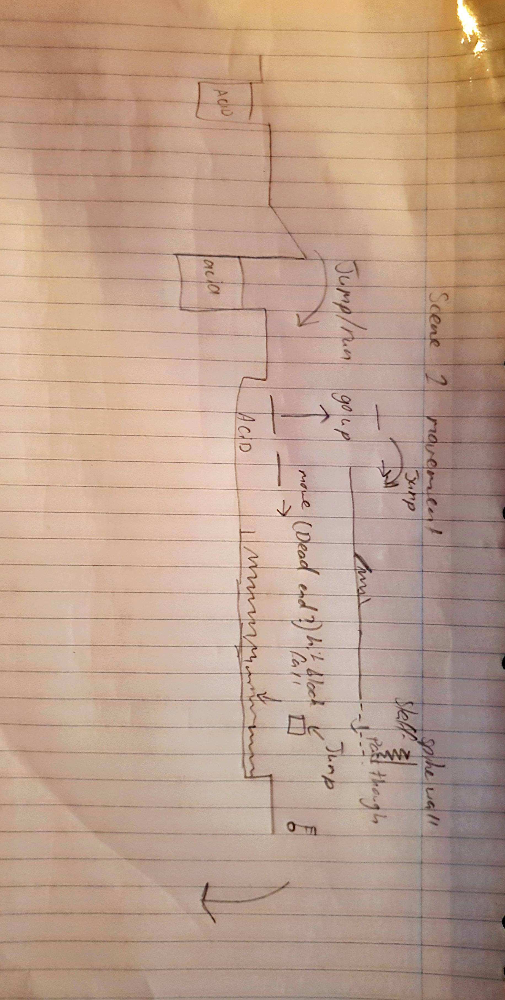
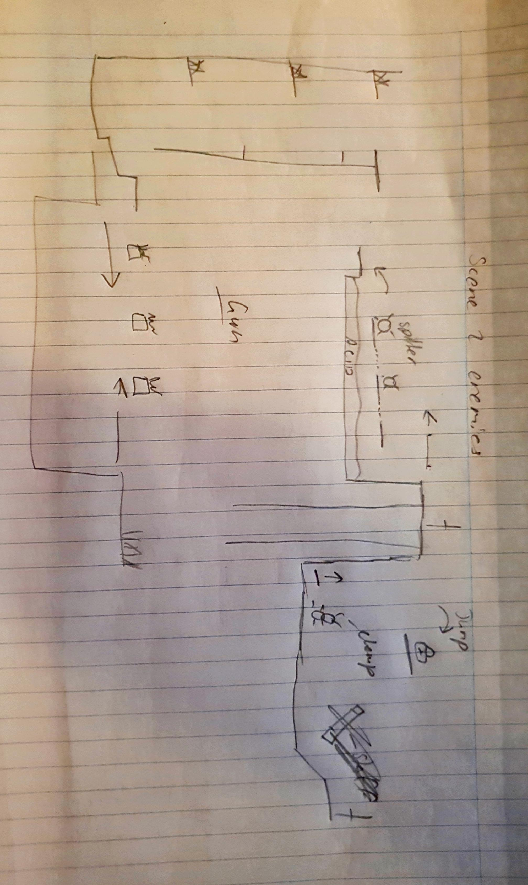
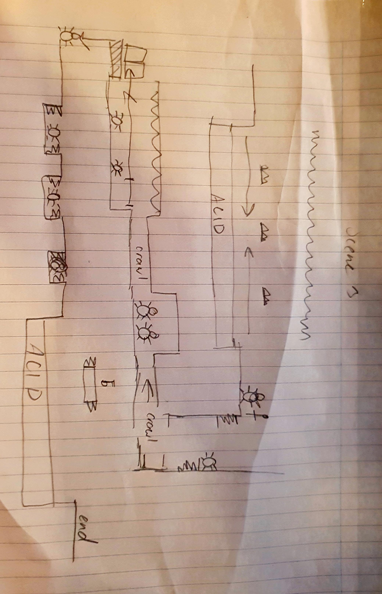

## Storage Rooms:
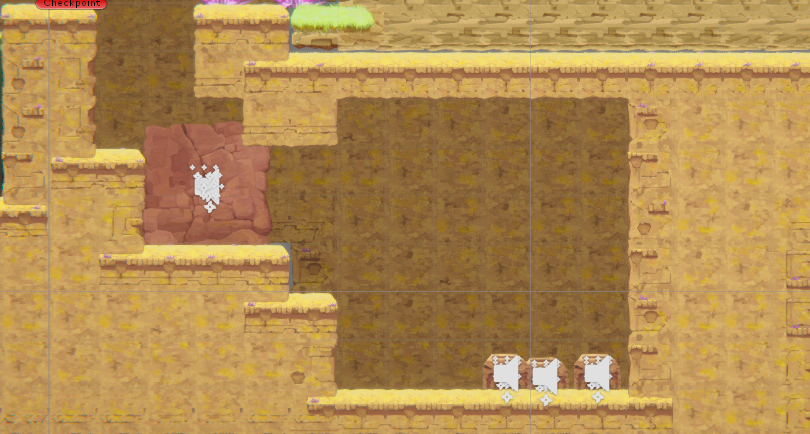
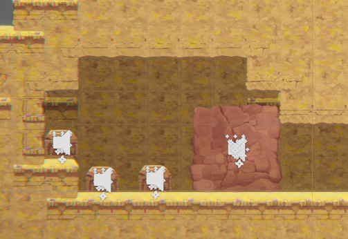

## Generative AI Use Acknowledgement
No Generative AI was used.

